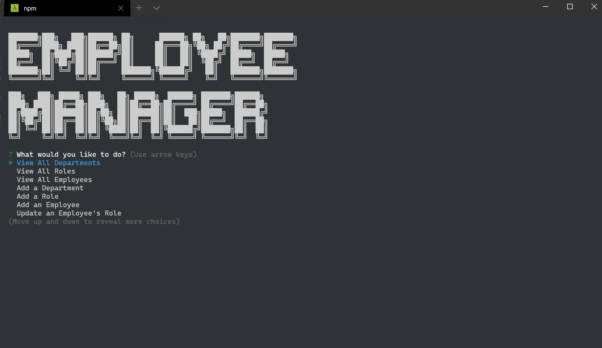

# Employee Manager

The App

## Description 

Employee Manager is a command line app that interacts with a MySQL database to so that you can easily keep track your company's departments, roles, and employees.

---

## Table of Contents 

- [Built With](#built-with)
- [Installation](#installation)
- [Usage](#usage)
- [Contributors](#contributors)
- [Acknowledgements](#acknowledgements)

---

## Built With

[Back to Contents](#table-of-contents)

---
## Installation

To install Employee Manager, you will first need to download or clone the contents of this repository. After that is done, open a terminal to the root directory of Employee Manager. Run `npm install` to install the app's dependencies. You will also need to have MySQL installed in order for the app to work. You will have to install that separately if you haven't installed it already.

[Back to Contents](#table-of-contents)

---

## Usage

[Video Tutorial](https://drive.google.com/file/d/13UkLrgf3CfAjvipaZ2PQmYJ3rc755--b/view)

To use the app, you will have to configure the connection settings for the mysql2 package. To do that, in ./utils/Database.js, change the values for user and password for the `const connection`. You can use "root" for the default MySQL username and your password for password. Or you could create a new user through MySQL in the command terminal and use those values. 

In MySQL, you will need to run `source db/schema.sql` to create the database, assuming you opened the terminal to the root directory of the app. If your terminal is opened elsewhere, you will have to specify the file path or change to the appropriate directory. You can also run `source db/seeds.sql` if you want to insert the demo values for departments, roles, and employees into the database. 

After everything is set up, exit MySQL if it is open, and run npm start in the terminal opened to the root directory of the app. Select the option you want with the arrow keys, press enter, and provide the requested input to see it in action. You can also view the link above for a demonstration.

[Back to Contents](#table-of-contents)
  
---

## Contributors

---
---
    
Craig Bennett
    
[Craig5117](https://github.com/Craig5117)

---
---

[Back to Contents](#table-of-contents)

---

## Acknowledgements

- [inquirer.js](https://www.npmjs.com/package/inquirer)
- [Tech badges by Ileriayo](https://github.com/Ileriayo/markdown-badges)
- [mysql2](https://www.npmjs.com/package/mysql2)
- [console.table](https://www.npmjs.com/package/console.table)

[Back to Contents](#table-of-contents)